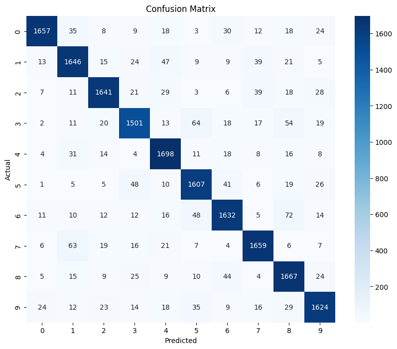

# 🔢 Street View House Numbers Recognition with Deep Learning

## 📌 Problem and Solution Summary

### Problem
Recognizing numbers in natural street scenes is a crucial step in automating location-based services.  
The **Street View House Numbers (SVHN)** dataset contains over **600,000** labeled digits extracted from real-world images.  
It has been used in applications like **Google Maps**, where automatic number recognition helps pinpoint buildings more accurately.

This project focuses on building and comparing **Artificial Neural Networks (ANNs)** and **Convolutional Neural Networks (CNNs)** to classify digits (0–9) from these images.

**Applications include:**
- 📍 Improving map accuracy by automatically transcribing address numbers.
- 🚗 Navigation systems and autonomous driving.
- 🏢 Automated postal services and package delivery routing.

---

## 🎯 Objective
Predict the digit depicted in a given image using multiple deep learning architectures and identify the most accurate model.

---

## 📊 Dataset
- **Source:** SVHN (subset to reduce computation time)
- **Format:** `.h5` file (preprocessed)
- **Images:** Grayscale, size `32x32`
- **Classes:** Digits `0–9`

Download dataset: [SVHN Official Site](http://ufldl.stanford.edu/housenumbers/)

---

## 🛠️ Model Development

### **1️⃣ ANN Model 1** – Basic Fully Connected Network
- **Architecture:**
  - Dense(64) → ReLU → Dense(32) → ReLU → Dense(10) → Softmax
- **Optimizer:** Adam (`lr=0.001`)
- **Epochs:** 20
- **Accuracy:** ~0.29
- **Observation:** Model failed to learn effectively. Both train and validation accuracies were low.

---

### **2️⃣ ANN Model 2** – Deeper Fully Connected Network
- **Architecture:**
  - Dense(256) → ReLU  
  - Dense(128) → ReLU → Dropout(0.2)  
  - Dense(64) → ReLU → Dense(64) → ReLU  
  - Dense(32) → ReLU → BatchNormalization  
  - Dense(10) → Softmax
- **Optimizer:** Adam (`lr=0.0005`)
- **Epochs:** 30
- **Accuracy:** ~0.67
- **Top Errors:** 2 → 7 (382 times), 8 → 5 frequently
- **Best Predictions:** 7, 4, 1
- **Worst Predictions:** 8, 2

**Classification Report (ANN 2):**
Accuracy: 0.67
F1-score: 0.67

---

### **3️⃣ CNN Model** – Convolutional Neural Network
- **Architecture:**
  - Conv2D(16) → LeakyReLU(0.1)  
  - Conv2D(32) → LeakyReLU(0.1) → MaxPooling(2x2) → BatchNorm  
  - Conv2D(32) → LeakyReLU(0.1)  
  - Conv2D(64) → LeakyReLU(0.1) → MaxPooling(2x2) → BatchNorm  
  - Flatten → Dense(32) → LeakyReLU(0.1) → Dropout(0.5)  
  - Dense(10) → Softmax
- **Optimizer:** Adam (`lr=0.001`)
- **Epochs:** 30
- **Accuracy:** ~0.91
- **Observation:** Best performing model, minimal overfitting, robust generalization.

**Classification Report (CNN):**
Accuracy: 0.91
Macro F1-score: 0.91
Consistently high precision and recall across all digits.

Classification report: 
 
               precision    recall  f1-score   support

           0       0.96      0.91      0.94      1814
           1       0.90      0.90      0.90      1828
           2       0.93      0.91      0.92      1803
           3       0.90      0.87      0.88      1719
           4       0.90      0.94      0.92      1812
           5       0.89      0.91      0.90      1768
           6       0.90      0.89      0.90      1832
           7       0.92      0.92      0.92      1808
           8       0.87      0.92      0.89      1812
           9       0.91      0.90      0.91      1804

    accuracy                           0.91     18000
   macro avg       0.91      0.91      0.91     18000
weighted avg       0.91      0.91      0.91     18000

---

## 📈 Business Impact
This model can be integrated into:
- **Mapping Services** – Enhance address recognition for location accuracy.
- **Logistics** – Automate package sorting based on detected address numbers.
- **Smart Cities** – Enable intelligent navigation and address verification systems.

---

## 💡 Recommendations
- **Technical Deployment:**
  - Integrate with OpenCV for real-time detection.
  - Use grayscale inputs to match training data.
- **Future Work:**
  - Expand training data to include color images.
  - Apply advanced data augmentation for robustness.
  - Experiment with transfer learning from pretrained CNNs.

---

## 🛠️ Tech Stack
- Python
- TensorFlow / Keras
- NumPy / Pandas / Matplotlib
- Jupyter Notebook

---

## 📂 Project Structure
├── svhn_classification.ipynb # Main training & evaluation notebook
├── data/ # Dataset (.h5 format)
└── README.md # Project documentation

---

## 👤 Author
**Patricio Galván Ledo**  
[LinkedIn](https://www.linkedin.com/in/patricio-galvan-ledo) • [Portfolio](#)